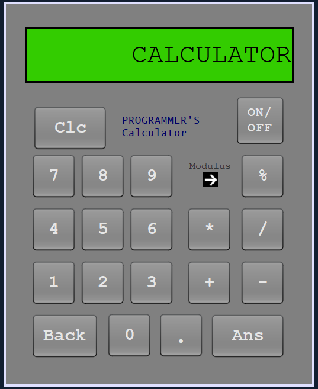

# Calculator_Netbeans_Apache



## Description
This Calculator GUI application is developed using Apache NetBeans in Java with Ant. It is a straightforward and user-friendly calculator that supports basic mathematical operations. The application does not require any database or advanced data structures.

## Features
- **Decimal Handling**: Supports calculations with decimals.
- **User-Friendly Design**: Clean and simplistic UI.
- **Modulus Functionality**: Includes modulus (`%`) calculations.
- **Basic Features**:
  - **Back (<--)**: Deletes the last character.
  - **Clear (Clc)**: Clears the current input.
  - **Ans (=)**: Displays the calculated result.
  - **ON/OFF Button**: Powers the calculator on or off.
- **Keyboard Accessibility**: Fully operable using keyboard keys.

## Operator Prioritization
The application follows a standard order of operations:
- **Highest Priority**: `*` (multiplication), `/` (division)
- **Medium Priority**: `%` (modulus)
- **Lowest Priority**: `+` (addition), `-` (subtraction)

## Keyboard Key Mappings
- **Numerical Input**: Keys `0-9`
- **Operand Input**: Keys `+`, `-`, `*`, `/`, `%`
- **Decimal Point**: Key `.`
- **Backspace**: `<--` (deletes the last character)
- **Enter**: `=` (calculates and displays the result)
- **Escape**: `Clc` (clears the current input)

**Note**: The ON/OFF functionality is controlled using the button on the screen only.

## Notable Challenges and Limitations
- **Display Limitations**: Limited space for showing very large numbers (input capped at a maximum limit).
- **No Scrolling**: The display does not allow scrolling; correcting an input error requires deleting characters from the end.
- **Mathematical Engine**: Uses the Nashorn JavaScript engine, which may be deprecated in future JDK releases.
- **No History Feature**: Does not retain a history of previous calculations.

## Current Functional Capabilities
- **Startup**:
  - Double-clicking the ON/OFF button toggles the calculator. When off, the display shows "CALCULATOR". When on, it displays "0".
- **Input Restrictions**:
  - Operators cannot be input before a number.
  - Entering an operator after another replaces the previous operator to prevent consecutive operators.
- **Decimal Handling**:
  - A `0` is appended before a decimal point if it is entered directly after an operator.
- **ON/OFF Functionality**:
  - Pressing the ON/OFF button during a calculation clears the data and shows "CALCULATOR" when turned off.

## Installation and Usage
1. **Clone the repository**:
   ```bash
   git clone https://github.com/AyushMohite08/Calculator_Netbeans_Apache.git

## License
This project is open-source and available under the MIT License.

## Contact
For any questions or feedback, please contact Ayush Mohite (mailto:ayushmohite0811@gmail.com).
